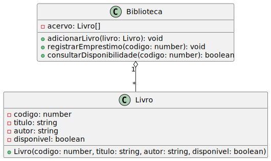

# Sistema de Gerenciamento de Biblioteca

Este projeto é uma aplicação simples em TypeScript para gerenciar o acervo de uma biblioteca, permitindo cadastrar livros, registrar empréstimos e consultar a disponibilidade de livros.

## Estrutura do Projeto

```
projeto/
├── src/
│   ├── components/
│   │   ├── Livro.ts          # Classe representando os livros
│   │   └── Biblioteca.ts     # Classe para gerenciar o acervo da biblioteca
│   └── index.ts              # Arquivo principal para testar a aplicação
├── dist/                     # Arquivos compilados (gerado após o build)
├── tsconfig.json             # Configuração do TypeScript
└── README.md                 # Documentação do projeto
```

## Funcionalidades

- **Cadastrar livros** no acervo.
- **Registrar empréstimos** de livros.
- **Consultar disponibilidade** de livros no acervo.

## Requisitos

- [Node.js](https://nodejs.org/) (versão 16 ou superior)
- [TypeScript](https://www.typescriptlang.org/) instalado globalmente:
  ```bash
  npm install -g typescript
  ```

## Como Executar

1. **Clone o repositório**:

   ```bash
   git clone <URL_DO_REPOSITORIO>
   cd projeto
   ```

2. **Instale o TypeScript**, caso ainda não tenha:

   ```bash
   npm install -g typescript
   ```

3. **Compile o projeto**:
   Na raiz do projeto, execute:

   ```bash
   tsc
   ```

4. **Execute o arquivo compilado**:
   ```bash
   node dist/index.js
   ```

## Exemplos de Uso

O arquivo `index.ts` já inclui testes básicos para demonstrar as funcionalidades:

- Cadastro de três livros (`1984`, `Dom Quixote`, `O Senhor dos Anéis`).
- Consulta da disponibilidade de um livro pelo código.
- Registro de empréstimo de um livro.
- Tentativa de emprestar um livro já emprestado.
- Consulta de um livro inexistente.

### Exemplo de Saída no Console

```
Cadastrando livros...
Livro "1984" adicionado ao acervo.
Livro "Dom Quixote" adicionado ao acervo.
Livro "O Senhor dos Anéis" adicionado ao acervo.

Consultando disponibilidade...
O livro "1984" está disponível.

Registrando empréstimo...
Empréstimo registrado: "1984".

Consultando disponibilidade novamente...
O livro "1984" está indisponível.

Tentando emprestar o mesmo livro novamente...
Erro: O livro "1984" já está emprestado.

Consultando um livro inexistente...
Erro: Livro com código 99 não encontrado.
```

## Estrutura de Classes

### **Classe Livro**

Representa os livros da biblioteca.

| Propriedade  | Tipo      | Descrição                                          |
| ------------ | --------- | -------------------------------------------------- |
| `codigo`     | `number`  | Identificador único do livro.                      |
| `titulo`     | `string`  | Título do livro.                                   |
| `autor`      | `string`  | Autor do livro.                                    |
| `disponivel` | `boolean` | Indica se o livro está disponível para empréstimo. |

---

### **Classe Biblioteca**

Gerencia o acervo da biblioteca.

| Método                     | Parâmetros       | Retorno   | Descrição                             |
| -------------------------- | ---------------- | --------- | ------------------------------------- |
| `adicionarLivro`           | `livro: Livro`   | `void`    | Adiciona um livro ao acervo.          |
| `registrarEmprestimo`      | `codigo: number` | `void`    | Registra o empréstimo de um livro.    |
| `consultarDisponibilidade` | `codigo: number` | `boolean` | Verifica se um livro está disponível. |

## Tecnologias Utilizadas

- TypeScript
- Node.js


